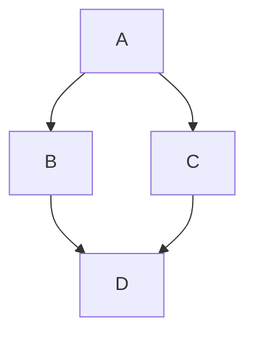

# Guia de Markdown
 Guia en https://github.github.com/gfm/
- headings
- ordered lists
- unordered lists
- formatting
- Code
- tables
- autolists
- lists
- images

## Listas desordenadas  desordenadas
1. Ordenadas con guiones 
`- Elemento `
1. Ordenadas con numeros (se ordenan solos):
`1. Elemento 1 ; 1. Elemento 2`

## Codigo de varias lineas
Usa tres tildes. Para que tenga colores pobes idioma ruby (rb)
```rb
for(i<1){
    x = a + 1;
    puts "Hello World";
}
```

## Tablas
Con "|": 
| Columna 1 | Columna 2 |
| --- | --- |
| Elemento 1.1 | Elemento 1.2 |
## Citas (>)
> Ejemplo de Cita, pueden tener encabezados y cosas dentro

## Diagramas
Utilizan mermaid:

